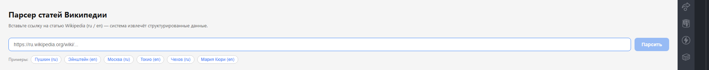
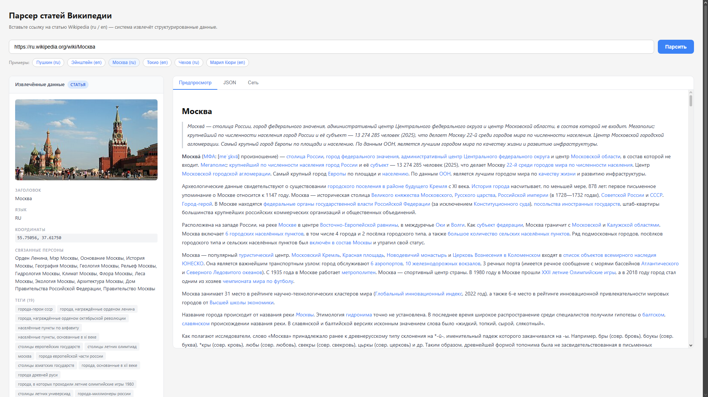
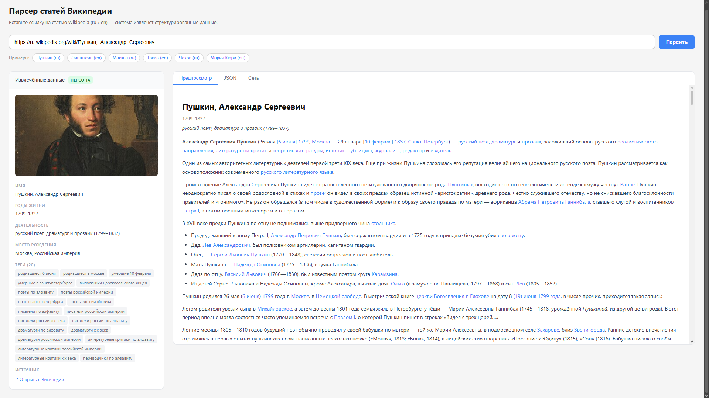
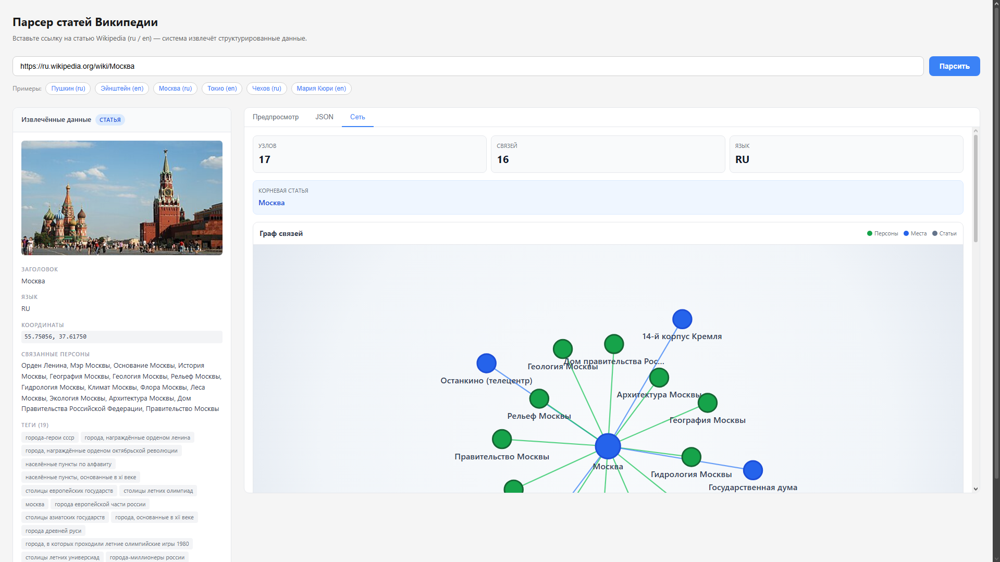
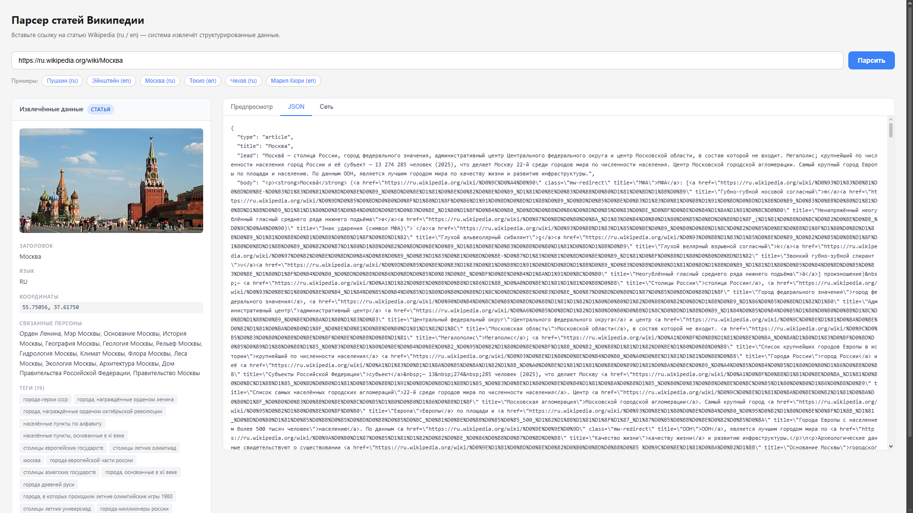
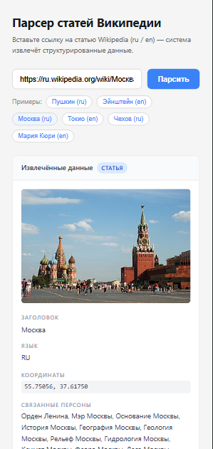

# WPARSER

**Render (prod):** ``








Парсер статей Википедии.
Приложение извлекает структурированные данные из статей (`article`/`person`), показывает очищенный контент, JSON и сеть связей (граф).

## Что заскринить и как назвать

Скриншоты класть в папку `docs/screenshots/` с именами:

1. `01-home.png` — стартовый экран (пустой ввод + примеры).
2. `02-article-preview.png` — результат для обычной статьи во вкладке «Предпросмотр».
3. `03-person-preview.png` — результат для персоны во вкладке «Предпросмотр».
4. `04-network-graph.png` — вкладка «Сеть» с графом связей.
5. `05-json-tab.png` — вкладка `JSON`.
6. `06-mobile.png` — мобильный вид (например, 390x844).

Рекомендуемый формат: PNG, ширина для десктопа 1600-1920.

## Возможности

- Парсинг ru/en страниц Википедии по ссылке.
- Типизация результата: `article` или `person`.
- Извлечение: заголовок, лид, биография/тело, теги, связанные персоны, семейные поля, координаты, миниатюра.
- Вкладки: `Предпросмотр`, `JSON`, `Сеть`.
- Визуализация сети связей с force-layout и перетаскиванием узлов.

## Требования

- Node.js 18+ (рекомендуется 20+).
- npm 9+.

## Быстрый старт

```bash
npm ci
npm run dev
```

Открыть: `http://localhost:3000`

## Скрипты

```bash
npm run dev          # разработка
npm run build        # production-сборка
npm run start        # запуск production
npm run test:parser  # CLI-проверка парсера
```

## Использование API

### 1) Парсинг статьи

`GET /api/parse-wikipedia?url=<wikipedia_url>`

Пример:
`/api/parse-wikipedia?url=https://ru.wikipedia.org/wiki/Пушкин,_Александр_Сергеевич`

### 2) Сеть связей

`GET /api/parse-wikipedia/network?url=<wikipedia_url>&limit=<число>`

Пример:
`/api/parse-wikipedia/network?url=https://ru.wikipedia.org/wiki/Москва&limit=16`

## Развёртывание

### Вариант 1: Vercel

1. Импортировать репозиторий в Vercel.
2. Framework preset: `Next.js`.
3. Build command: `npm run build`.
4. Install command: `npm ci`.
5. Deploy.

### Вариант 2: VPS / выделенный сервер

```bash
npm ci
npm run build
npm run start
```

По умолчанию сервер поднимается на порту `3000`. Для продакшена обычно ставят reverse proxy (например, Nginx).

## Частые проблемы

### `Cannot find module './xxx.js'` в `.next/server`

Сломался кэш сборки:

```bash
rm -rf .next
npm run dev
```

Для Windows PowerShell:

```powershell
Remove-Item .next -Recurse -Force
npm run dev
```

### `Extra attributes from the server: bis_register`

Обычно это инжект атрибутов браузерным расширением. Проверь страницу в инкогнито/без расширений.
